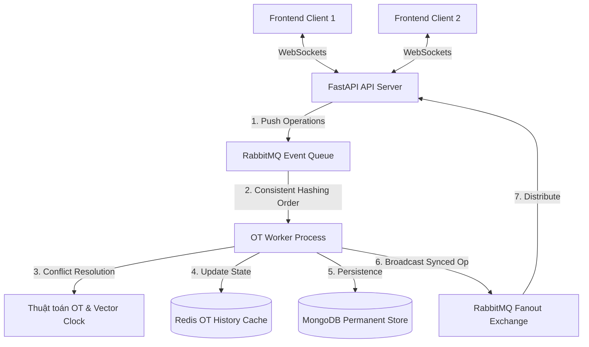

<div align="center">
  <h1>📝 Collaborative Systems</h1>
  <p><strong>Hệ thống Soạn thảo Văn bản Cộng tác theo Thời gian thực</strong></p>
  <p>
    Một nền tảng chỉnh sửa tài liệu đa người dùng hiệu năng cao (tương tự Google Docs), 
    <br/>giải quyết bài toán xung đột dữ liệu với thuật toán Operational Transformation (OT).
  </p>
  
  [](https://www.python.org)
  [](https://nextjs.org/)
  [](https://fastapi.tiangolo.com/)
  [](https://www.rabbitmq.com/)
  [](https://www.mongodb.com/)
  [](https://redis.io/)
</div>

<hr />

## 📖 Mục Lục (Table of Contents)
- [🌟 Tổng Quan Dự Án](#-tổng-quan-dự-án)
- [✨ Tính Năng Nổi Bật](#-tính-năng-nổi-bật)
- [🏗️ Kiến Trúc & Thiết Kế Hệ Thống](#-kiến-trúc--thiết-kế-hệ-thống)
- [💻 Công Nghệ Sử Dụng](#-công-nghệ-sử-dụng)
- [🚀 Hướng Dẫn Cài Đặt (Getting Started)](#-hướng-dẫn-cài-đặt-getting-started)
- [📂 Cấu Trúc Dự Án](#-cấu-trúc-dự-án)
- [🧪 Kiểm Thử (Testing)](#-kiểm-thử-testing)
- [🤝 Đóng Góp (Contributing)](#-đóng-góp-contributing)
- [👥 Người Đóng Góp (Contributors)](#-người-đóng-góp-contributors)

---

## 🌟 Tổng Quan Dự Án

**Collaborative Systems** là một hệ thống biên tập tài liệu cộng tác cho phép nhiều người dùng cùng chỉnh sửa một văn bản tại cùng một thời điểm. 

Dự án áp dụng thuật toán **Centralized Operational Transformation (OT)** và **Vector Clocks** nhằm duy trì tính nhất quán tuyệt đối của tài liệu, bất chấp độ trễ mạng hay thao tác đồng thời. Bằng việc tách rời REST API/WebSockets Server và OT Worker qua hệ thống Message Broker (RabbitMQ), hệ thống đạt được tính ổn định và khả năng mở rộng ngang (Horizontal Scaling) vô cùng mạnh mẽ.

---

## ✨ Tính Năng Nổi Bật

- ⚡ **Đồng bộ thời gian thực siêu thấp (Ultra-low Latency):** Thay đổi văn bản được đồng bộ tới tất cả client với tốc độ tính bằng mili-giây qua WebSockets.
- 👥 **Quản lý Hiện diện (Presence) & Con trỏ độc lập (Live Cursors):** Hiển thị danh sách người dùng Online/Offline và theo dõi chuyển động con trỏ chuột của từng cá nhân kèm màu sắc nhận diện riêng biệt.
- 🔐 **Hệ thống Phân quyền Linh hoạt (RBAC):** Chủ sở hữu (Owner) có thể cấp quyền `Viewer` (Chỉ xem) hoặc `Editor` (Chỉnh sửa). Mọi thay đổi quyền được cập nhật ngay lập tức (Real-time).
- 🎨 **Giao diện Cao cấp (Modern UI/UX):** Trải nghiệm người dùng tuyệt vời với phong cách thiết kế Glassmorphism, hỗ trợ giao diện Sáng/Tối (Dark/Light mode) dựa trên Tailwind CSS v4 & Shadcn/UI.
- 🛡️ **Bảo mật JWT & Protected Routes:** Đảm bảo quyền riêng tư và xác thực bảo mật cho mọi tài liệu cá nhân.

---

## 🏗️ Kiến Trúc & Thiết Kế Hệ Thống

Hệ thống được thiết kế theo hướng sự kiện (Event-Driven Architecture). Mọi thao tác gõ (Operations) đều được định tuyến qua cơ chế **Consistent Hashing** theo ID tài liệu (Document ID) vào RabbitMQ để đảm bảo việc xử lý luồng thao tác luôn diễn ra **tuần tự nghiêm ngặt (Strict Ordering)**, tránh tranh chấp đa luồng.



### Thuật toán cốt lõi:
- **Operational Transformation (OT 3x3 Matrix):** Xử lý ma trận biến đổi toán học khi các thao tác `Insert`, `Delete`, `Retain` diễn ra cùng lúc trên một index.
- **Tie-breaker:** Cơ chế phân xử logic khi hai người dùng cùng thao tác đè lên một vị trí, đảm bảo sự hội tụ (Convergence) của tài liệu trên tất cả các Client.

---

## 💻 Công Nghệ Sử Dụng

### 🌐 Frontend (Client-side)
- **Framework Core:** Next.js 16 (App Router), React 19
- **Ngôn ngữ:** TypeScript
- **Styling & UI:** Tailwind CSS v4.0, Shadcn/UI, Lucide React
- **Networking:** Axios (với JWT interceptor), Native WebSockets

### ⚙️ Backend (Server-side)
- **Framework Core:** FastAPI (Python 3.11+), Uvicorn (ASGI)
- **Message Broker:** RabbitMQ (`aio-pika`)
- **Database:** MongoDB (`motor` async driver)
- **Caching:** Redis (`redis.asyncio`)
- **Testing:** Pytest

---

## 🚀 Hướng Dẫn Cài Đặt (Getting Started)

### Yêu Cầu Môi Trường
- **Docker & Docker Compose** (Bắt buộc cho Infrastructure)
- **Node.js** (v18+)
- **Python** (v3.11+)

### 1. Khởi động Cơ sở hạ tầng (Infrastructure)
Dự án cung cấp sẵn tệp Docker Compose để chạy MongoDB, Redis, RabbitMQ và các giao diện quản trị trực quan.
```bash
cd backend
docker-compose up -d
```

> **🎛️ Bảng Điều Khiển Hạ Tầng (Management Dashboards):**
> - 🐰 **RabbitMQ Management:** [http://localhost:15672](http://localhost:15672) *(Tài khoản: `nam.dev` / Mật khẩu: `Nam12345@`)*
> - 🍃 **Mongo Express (MongoDB UI):** [http://localhost:8085](http://localhost:8085) *(Tài khoản: `admin` / Mật khẩu: `admin`)*
> - 🔴 **Redis Commander (Redis UI):** [http://localhost:8086](http://localhost:8086)

### 2. Thiết lập Backend Server & OT Worker
Mở **2 cửa sổ Terminal mới** tại thư mục `backend/`.

**Terminal 1: Chạy API Server**
```bash
python -m venv venv
# Windows: .\venv\Scripts\activate | macOS/Linux: source venv/bin/activate
pip install -r requirements.txt

# Tạo file .env từ .env.example
# Khởi chạy server API
uvicorn app.main:app --host 0.0.0.0 --port 8000 --reload
```

**Terminal 2: Chạy OT Worker**
```bash
# Kích hoạt môi trường ảo (venv) trước
# Windows: .\venv\Scripts\activate | macOS/Linux: source venv/bin/activate
python -m app.worker.consumer
```

> 💡 *Mẹo (Scale-out): Bạn có thể chạy song song nhiều OT Worker để chia tải (Horizontal Scaling) bằng cách điều chỉnh cấu hình `RABBITMQ_NUM_QUEUES` và biến môi trường `WORKER_QUEUES`. Xem hướng dẫn chi tiết tại [backend/readme.md](backend/readme.md).*

### 3. Thiết lập Frontend Next.js
Mở Terminal mới tại thư mục `frontend/`:
```bash
npm install
# Khởi tạo biến môi trường (.env)
echo "NEXT_PUBLIC_API_BASE_URL=http://localhost:8000/api" > .env
# Chạy ứng dụng Frontend
npm run dev
```
🎉 **Trải nghiệm ứng dụng tại:** [http://localhost:4000](http://localhost:4000)

---

## 📂 Cấu Trúc Dự Án

Kiến trúc Monorepo được chia ranh giới rõ ràng:

```text
Collaborative-Systems/
├── backend/                  # Logic xử lý thuật toán & API Backend
│   ├── app/api/              # Routes cho REST API & WebSockets
│   ├── app/core/             # Thuật toán cốt lõi (OT, Vector Clock)
│   ├── app/models/           # Pydantic Schemas (Data Validation)
│   ├── app/worker/           # RabbitMQ Consumer (Xử lý tác vụ ngầm)
│   ├── infra/                # Repository Pattern giao tiếp DB, Cache, MQ
│   └── tests/                # Unit Tests (Pytest)
│
├── benchmarks/               # Các kịch bản kiểm thử tải (Load Testing) và đo lường hiệu năng
│   └── locustfile.py         # Kịch bản kiểm thử với Locust cho OT Worker và API
|
└── frontend/                 # Giao diện người dùng
    ├── app/                  # Next.js App Router (Pages, Layouts)
    ├── components/ui/        # Shadcn Primitives (Button, Dialog, ...)
    ├── components/           # Core components (Editor, Sidebar, ...)
    ├── hooks/                # React Hooks tùy chỉnh
    └── lib/                  # Utilities, API Axios instances, Auth Context
```

---

## 🧪 Kiểm Thử (Testing)

Đảm bảo độ chính xác tuyệt đối của bộ biến đổi OT (Index Shifting) bằng cách chạy Unit Tests trên Backend:
```bash
cd backend
python -m pytest tests/
```

---

## 🤝 Đóng Góp (Contributing)

Dự án luôn hoan nghênh sự đóng góp từ cộng đồng. Quy trình đóng góp tiêu chuẩn:
1. **Fork** dự án này về tài khoản của bạn.
2. Tạo **Branch** cho tính năng/bản vá: `git checkout -b feature/AmazingFeature`
3. **Commit** thay đổi của bạn: `git commit -m 'Add some AmazingFeature'`
4. **Push** lên Branch: `git push origin feature/AmazingFeature`
5. Mở một **Pull Request** trên Repository gốc và mô tả chi tiết thay đổi của bạn.

*(Vui lòng tuân thủ các quy chuẩn định dạng code: PEP8 cho Python và ESLint/Prettier cho Next.js).*

---

## 👥 Người Đóng Góp (Contributors)

Dự án này được phát triển, cống hiến và bảo trì bởi sự phối hợp của các thành viên tài năng:

<a href="https://github.com/Nam0397681436/Collaborative-Systems/graphs/contributors">
  
</a>

*Bạn muốn đóng góp? Hãy xem mục **[Đóng Góp](#-đóng-góp-contributing)**!*

---

<div align="center">
  <h3>🌟 Star History</h3>
  <a href="https://star-history.com/#Nam0397681436/Collaborative-Systems&Date">
    
  </a>
</div>

<br/>

<div align="center">
  <p>Được xây dựng với ❤️ bởi cộng đồng lập trình viên Việt Nam.</p>
</div>
