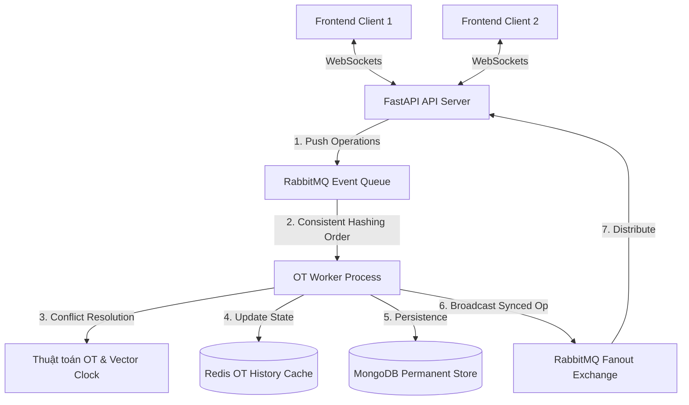

# Collaborative Systems - Hệ thống Soạn thảo Văn bản Cộng tác theo Thời gian thực

Dự án này là một **Hệ thống Soạn thảo Văn bản Cộng tác theo Thời gian thực (Real-time Collaborative Text Editor)** có kiến trúc tương tự như Google Docs. Hệ thống sử dụng thuật toán **Centralized Operational Transformation (OT)** nhằm giải quyết xung đột khi nhiều người dùng cùng chỉnh sửa một tài liệu tại một thời điểm, kết hợp với hạ tầng phân tán để đạt hiệu năng tối ưu và tính nhất quán dữ liệu cao.

Dự án được tổ chức dưới dạng monorepo gồm 2 phần chính:
*   **`backend`**: Xây dựng bằng FastAPI (Python), RabbitMQ, Redis và MongoDB.
*   **`frontend`**: Xây dựng bằng Next.js (App Router, React 19), Tailwind CSS và TypeScript.

---

## 🏗️ Tổng quan Kiến trúc Hệ thống

Hệ thống hoạt động theo cơ chế luồng sự kiện thời gian thực (Event-Driven Architecture):



### Nguyên lý Hoạt động của Hệ thống OT:
1. **Gửi Thao tác (Operations)**: Khi người dùng gõ phím (Insert/Delete/Retain), frontend sẽ đóng gói thao tác kèm theo **Đồng hồ Vector (Vector Clock)** của client hiện tại và gửi lên API Server qua kết nối WebSocket.
2. **Xếp hàng & Điều phối**: API Server đẩy các thao tác vào **RabbitMQ**. Sử dụng thuật toán **Consistent Hashing** dựa trên `doc_id`, các thao tác của cùng một tài liệu luôn được định tuyến đến cùng một Queue để xử lý tuần tự (Strict Ordering), tránh tranh chấp đa luồng.
3. **Biến đổi Thao tác (Operational Transformation)**: **OT Worker** tiêu thụ thông điệp từ Queue, kiểm tra tính nhân quả qua Vector Clock. Nếu phát hiện xung đột (xảy ra khi hai người dùng cùng gõ đồng thời), Worker sẽ áp dụng ma trận OT để biến đổi lại các chỉ số con trỏ (Index Shifting) và đưa ra trạng thái tài liệu hợp nhất chính xác.
4. **Cập nhật & Phát sóng (Broadcast)**: Trạng thái mới được ghi nhận cực nhanh vào **Redis Cache** (phục vụ lịch sử OT gần nhất) và lưu trữ lâu dài trong **MongoDB**. Cuối cùng, Worker phát tín hiệu broadcast qua RabbitMQ Fanout Exchange để API Server gửi thông tin cập nhật tức thời về cho toàn bộ các client đang truy cập tài liệu đó.

---

## 🛠️ Công Nghệ Sử Dụng (Tech Stack)

### Backend
*   **FastAPI**: Framework Python có hiệu suất cực cao dựa trên AsyncIO.
*   **MongoDB**: Cơ sở dữ liệu NoSQL lưu trữ thông tin Document, User và Operation Logs.
*   **RabbitMQ**: Message Broker đảm nhận điều phối hàng đợi thao tác và phát sóng sự kiện.
*   **Redis**: In-memory database làm cache tốc độ cao cho Lịch sử OT và quản lý khóa phân tán.
*   **Pytest**: Framework phục vụ viết unit test và tích hợp để bảo chứng thuật toán OT.

### Frontend
*   **Next.js 16 (App Router)**: Framework React mạnh mẽ cho việc tối ưu render và routing.
*   **React 19 & TypeScript**: Xây dựng UI an toàn về kiểu dữ liệu (Type-safe).
*   **Tailwind CSS & Shadcn/UI**: Hệ thống styling và bộ thành phần giao diện hiện đại, responsive, hỗ trợ Dark/Light Mode.
*   **WebSockets**: Duy trì kết nối hai chiều thời gian thực giữa Client và API Server.

---

## 📂 Cấu Trúc Dự Án

```text
Collaborative-Systems/
├── backend/            # Mã nguồn Backend (FastAPI, OT Worker, Infrastructure)
│   ├── app/
│   │   ├── api/        # REST API & WebSocket Controller
│   │   ├── core/       # Thuật toán OT cốt lõi (3x3 Matrix)
│   │   ├── models/     # Schema Models (Pydantic)
│   │   └── worker/     # RabbitMQ Consumer & Worker xử lý OT
│   ├── infra/          # MongoDB, Redis & RabbitMQ Gateways
│   ├── tests/          # Unit tests cho thuật toán OT
│   └── docker-compose.yml # File cấu hình hạ tầng container
│
├── frontend/           # Mã nguồn Frontend (Next.js, Tailwind, React 19)
│   ├── app/            # Next.js App Router (Landing, Auth, Dashboard, Editor)
│   ├── components/     # UI Components (Collaborator list, Share dialog, Editor canvas)
│   ├── hooks/          # Custom React hooks
│   └── lib/            # Auth Context, Axios Clients và API services
│
└── README.md           # Hướng dẫn tổng quan hệ thống (File này)
```

---

## 🚀 Hướng Dẫn Khởi Chạy Nhanh (Quick Start)

Yêu cầu máy cài sẵn: **Docker & Docker Compose**, **Node.js (v18+)**, **Python (v3.11+)**.

### 1. Chạy Hạ Tầng (Docker)

Khởi động các container MongoDB, Redis, RabbitMQ:
```bash
cd backend
docker-compose up -d
```

### 2. Thiết lập và Chạy Backend

Mở terminal mới tại thư mục `backend/`:

1.  Tạo và kích hoạt môi trường ảo:
    ```bash
    python -m venv venv
    # Windows
    .\venv\Scripts\activate
    # macOS/Linux
    source venv/bin/activate
    ```
2.  Cài đặt các thư viện phụ thuộc:
    ```bash
    pip install -r requirements.txt
    ```
3.  Cấu hình môi trường: Tạo file `.env` từ `.env.example` và cấu hình các thông số kết nối Database, Redis, RabbitMQ.
4.  Chạy **FastAPI Server**:
    ```bash
    uvicorn app.main:app --host 0.0.0.0 --port 8000 --reload
    ```
5.  Mở terminal khác (đã kích hoạt `venv`) chạy **OT Worker**:
    ```bash
    python -m app.worker.consumer
    ```

### 3. Thiết lập và Chạy Frontend

Mở một terminal mới tại thư mục `frontend/`:

1.  Cài đặt các gói thư viện:
    ```bash
    npm install
    # Hoặc sử dụng pnpm
    pnpm install
    ```
2.  Cấu hình môi trường: Tạo file `.env` với nội dung trỏ tới API Backend:
    ```env
    NEXT_PUBLIC_API_BASE_URL=http://localhost:8000/api
    ```
3.  Khởi chạy chế độ phát triển (Development):
    ```bash
    npm run dev
    ```
    Frontend sẽ chạy tại địa chỉ: [http://localhost:4000](http://localhost:4000)

---

## 🧪 Chạy Kiểm Thử (Testing)

Để đảm bảo thuật toán OT hoạt động chính xác và không xảy ra hiện tượng lệch con trỏ văn bản (Index Shifting), hãy chạy bộ test suite trên Backend:
```bash
cd backend
python -m pytest tests/
```

---

## 🛡️ Tính Năng Nổi Bật Đã Hoàn Thành
- **Real-time Synchronization**: Đồng bộ tức thì nội dung gõ phím giữa nhiều tab/trình duyệt.
- **Collaborator Sidebar**: Danh sách người dùng trực tuyến/ngoại tuyến trong phòng kèm chỉ thị màu cursor độc bản.
- **Role & Authorization**: Phân quyền chi tiết (Owner, Editor, Viewer) cho từng tài liệu.
- **Share Dialog**: Chia sẻ liên kết soạn thảo, tìm kiếm và phân quyền cộng tác viên linh hoạt.
- **Dark/Light Mode**: Thiết kế giao diện hiện đại tối ưu trải nghiệm người dùng ban đêm.

Gặp bất kỳ vấn đề gì trong quá trình cài đặt, vui lòng kiểm tra file log của backend hoặc tab Console trên trình duyệt frontend. Chúc bạn có trải nghiệm cộng tác tuyệt vời!
